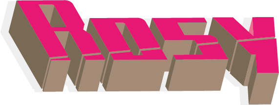

<p align="center"></p>
<h1 align="center">Rosy</h1>

<div align="center">

  [](https://opensource.org/licenses/MIT)

</div>

<p align="center">
This is an early incubation project, developed using Vue3 + Vite + TSX
<br />
</p>


## 🔨: Install


```sh
pnpm install

pnpm run dev
```

## 🧩: Structure

```
in the building
```
